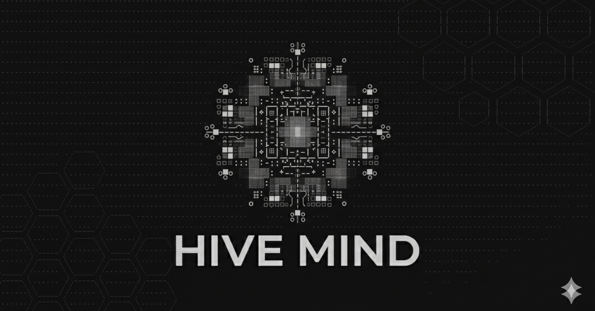

<div align="center">

</div>

# Hive Mind

[](https://github.com/ziyilam3999/hive-mind/actions/workflows/ci.yml)
[](LICENSE)


PRD-driven orchestrator that turns a product requirements document into working code through a multi-stage AI pipeline with human checkpoints.

> **Design iteration 3** — ground-up redesign following two earlier prototypes. Semver tracks the public release lifecycle starting at `v0.1.0`.

```
PRD  -->  SPEC  -->  PLAN  -->  EXECUTE  -->  REPORT
              [ human approval between each stage ]
```

## Features

- **PRD-to-code pipeline** — Feed in a product requirements doc, get working code out
- **Multi-stage AI agents** — Specialized agents for spec generation, planning, execution, and reporting
- **Human-in-the-loop** — Approve, reject with feedback, or abort at every checkpoint
- **Session continuity** — Resume interrupted pipelines without losing progress
- **Learning system** — Agents capture and graduate learnings across runs

## Tech Stack

- **TypeScript** (ESM) — Fully typed, npm-publishable CLI
- **Claude API** via Claude Code CLI — Powers all AI agents
- **Vitest** — Comprehensive test suite
- **Zod** — Runtime config validation

## Quick Start

### Prerequisites

- Node.js >= 18
- [Claude Code CLI](https://docs.anthropic.com/en/docs/claude-cli) installed and authenticated

### Install & Run

```bash
npm i -g hive-mind

# Start a pipeline
hive-mind start --prd ./my-project.md

# Check status
hive-mind status

# Approve a checkpoint
hive-mind approve

# Reject with feedback
hive-mind reject --feedback "The spec is missing error handling requirements"
```

## How It Works

1. **SPEC** — An AI agent reads your PRD and generates a detailed technical specification
2. **PLAN** — A planner agent breaks the spec into user stories with execution order
3. **EXECUTE** — Each story goes through build, verify, commit, and learn sub-stages
4. **REPORT** — A final report summarizes what was built, test results, and learnings

Each stage pauses for human review before continuing to the next.

## Project Structure

```
src/
  stages/       # Pipeline stage implementations
  agents/       # Agent spawner, prompts, model mapping
  state/        # Execution plan, checkpoints, logs
  config/       # Schema and loader
  memory/       # Learning system and graduation
  reports/      # Parser and templates
  utils/        # File I/O, shell, token counting
  __tests__/    # Vitest test suite
```

## License

MIT
